 
<!-- Another alternative with HTML and background -->
<div align="center" style="background-color:#f0fff0;  border-radius:8px; margin-bottom:20px">
  <h1 style="color:green; margin:0">ARCHITECTURE DIAGRAM FOR HEALTHCARE MICROSERVICE PROJECT</h1>
</div>


# Monitoring and Observability Stack

## <span style="color:green">1. Deployment with Google JIB and Docker</span>

### Building and Pushing Docker Images

Google JIB is used for efficient containerization of our microservices:

```bash
# Build and push Docker images to Docker Hub
mvn compile jib:build  
```

### Managing the Monitoring Stack

```bash
# Restart monitoring services
docker-compose restart prometheus grafana

# Start the entire stack
docker-compose up -d

# View logs
docker-compose logs -f [service-name]
```

## <span style="color:green">2. Centralized Logging with ELK Stack</span>

Our architecture implements a comprehensive ELK (Elasticsearch, Logstash, Kibana) stack for centralized logging.

### 🛠️ ELK Components

#### 🔹 1. Filebeat
- Reads logs from Spring Boot microservices (`./monitoring/logs/*.log`)
- Forwards them to Logstash

#### 🔹 2. Logstash
- Parses and processes the logs using configured pipelines
- Sends structured log data to Elasticsearch

#### 🔹 3. Elasticsearch
- Stores the logs in an indexed, searchable format
- Acts as the data backend for Kibana

#### 🔹 4. Kibana
- Connects to Elasticsearch
- Visualizes logs using powerful dashboards and search capabilities

### Elasticsearch Status
When successfully running, Elasticsearch provides a health status:

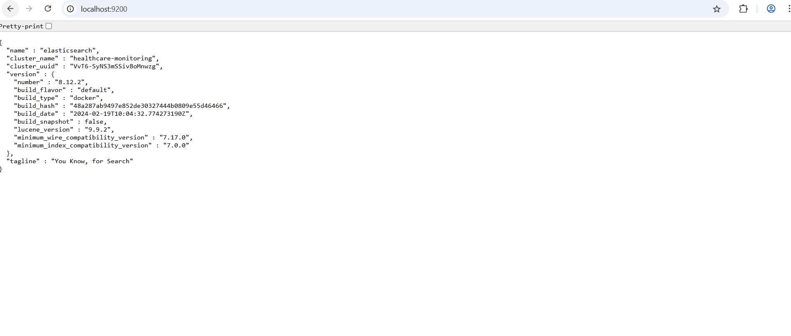

### Logstash Monitoring
Logstash exposes an HTTP monitoring API to check its status:

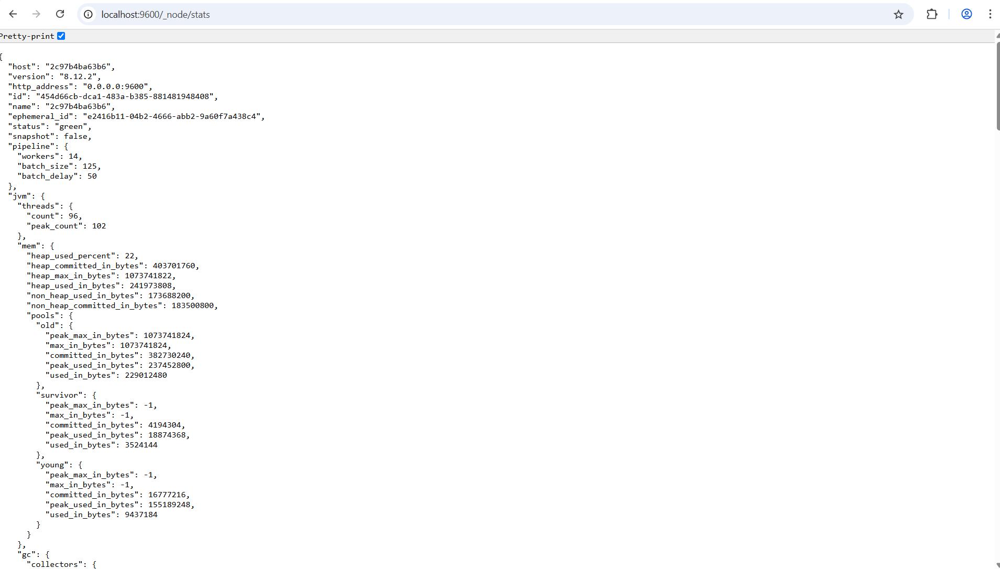

### Kibana Dashboard
Customizable dashboards for log visualization:

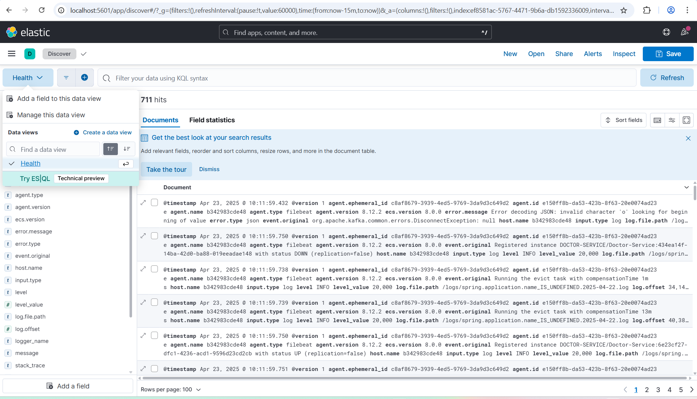

Dashboard visualization example:

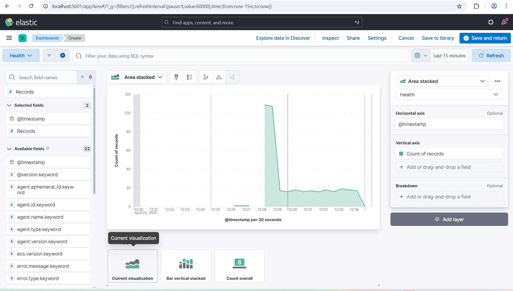

### ✅ Elasticsearch Use Cases

| Use Case | Description | Relevance |
|----------|-------------|-----------|
| ✅ Centralized Logging | Already implemented via ELK stack | ✅ Done |
| 🔍 App Data Search | Full-text search over patient or appointment data | ⭐ Recommended |
| 📈 Business Insights | Custom app-level metrics and reporting | ⭐ Recommended |
| 🚨 Security Monitoring | Logins, failed access, audit trails | Optional |
| 🔁 Distributed Tracing (APM) | Trace requests across microservices | Optional |
| 📦 Catalog/Inventory Search | E-commerce-style filtering | Optional |
| 👀 User Behavior Analysis | Understand how users interact with your platform | Optional |

## <span style="color:green">3. Event Streaming with Kafka</span>

Kafka is used for reliable event streaming between microservices.

### Kafka UI
The Kafka UI dashboard provides a comprehensive view of your Kafka cluster:

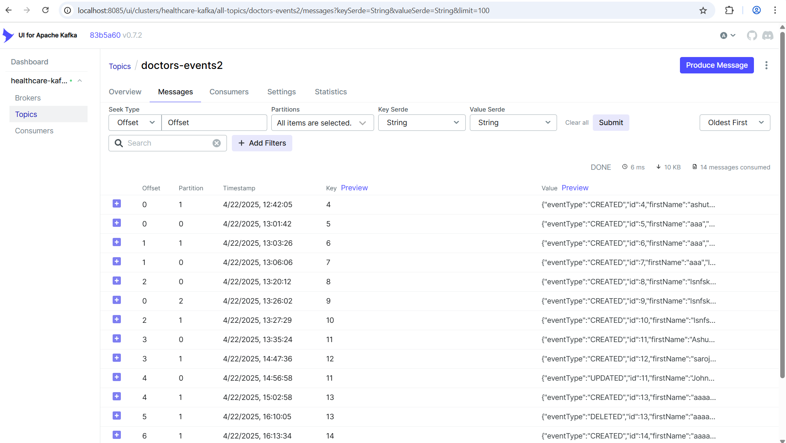

### Consumer Monitoring
View and monitor all connected consumers:

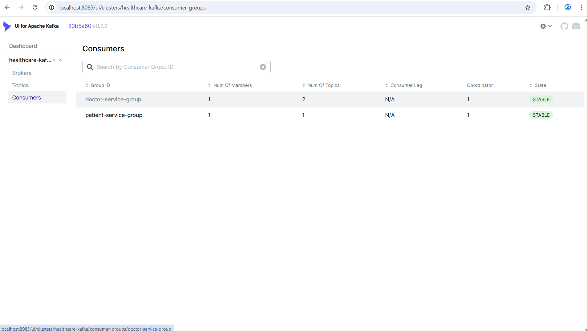

### Message Inspection
Inspect the JSON format of messages published to topics:

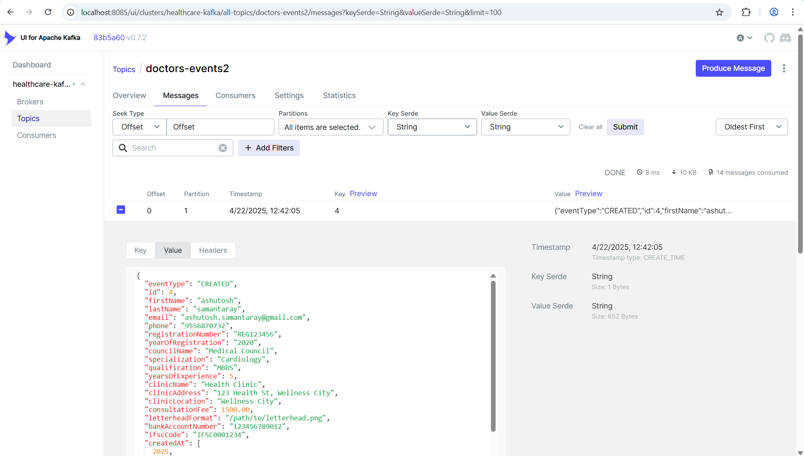

## <span style="color:green">4. Metrics Monitoring with Prometheus and Grafana</span>

Real-time metrics collection and visualization with Prometheus and Grafana.

### Prometheus Dashboard
Prometheus collects and stores metrics in a time-series database:

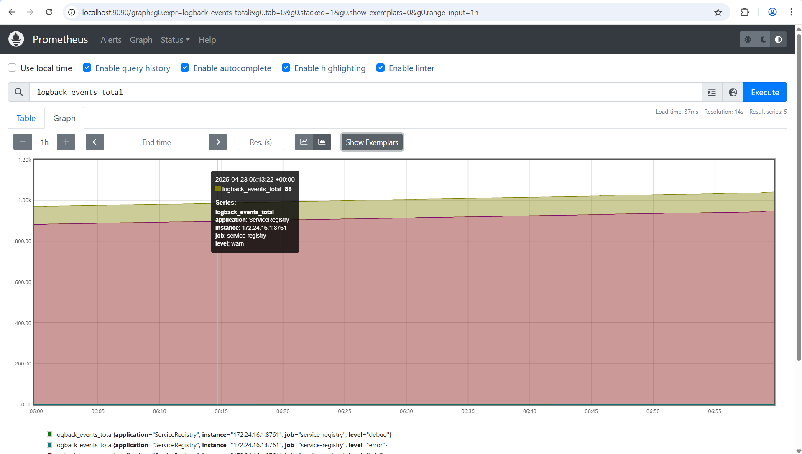

### Grafana Dashboards
Grafana provides rich visualization of metrics:

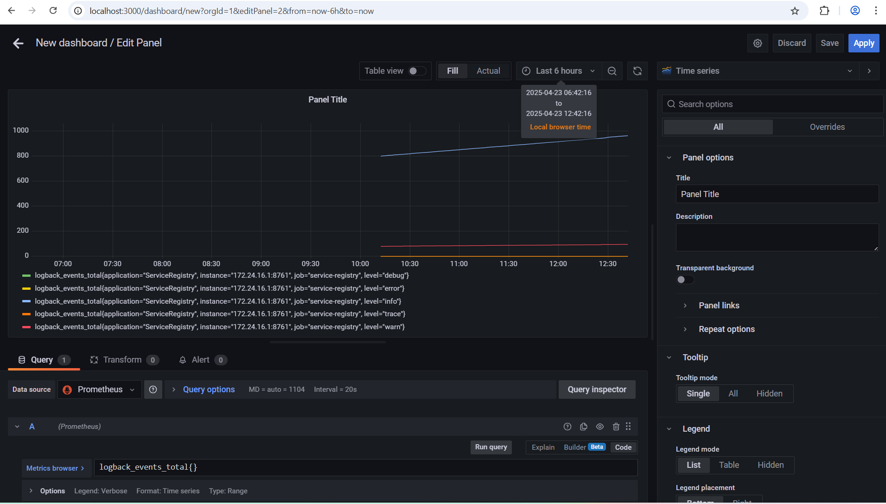

## Integration

### Service Configuration

Each Spring Boot microservice should include these dependencies:

```xml
<!-- Prometheus Metrics -->
<dependency>
    <groupId>io.micrometer</groupId>
    <artifactId>micrometer-registry-prometheus</artifactId>
</dependency>

<!-- Logging -->
<dependency>
    <groupId>net.logstash.logback</groupId>
    <artifactId>logstash-logback-encoder</artifactId>
    <version>7.3</version>
</dependency>
```

Add these properties to your `application.properties`:

```properties
# Prometheus endpoint
management.endpoints.web.exposure.include=prometheus,health,info,metrics
management.endpoint.health.show-details=always

# Logging pattern for file
logging.file.name=./monitoring/logs/${spring.application.name}.log
```

### Docker Compose Configuration

Example `docker-compose.yml` snippet for the monitoring stack:

 
## Accessing the Monitoring Tools

| Tool          | URL                   | Default Credentials |
|---------------|-----------------------|---------------------|
| Kibana        | http://localhost:5601 | None                |
| Prometheus    | http://localhost:9090 | None                |
| Grafana       | http://localhost:3000 | admin/admin         |
| Kafka UI      | http://localhost:8085 | None                |
| Elasticsearch | http://localhost:9200 | None                |
| Keycloak      | http://localhost:8080 | admin/admin         |

# <span style="color: green;">Redis Integration</span>

## 🔍 What is Redis?

- **In-memory**: Stores data in RAM for ultra-fast access.
- **Key-value store**: Stores data as key-value pairs.
- **NoSQL**: It's non-relational (not a traditional SQL database).
- **Persistent**: Though in-memory, it can persist data to disk.

## ✅ Why Do We Use Redis?

Redis is used for scenarios where speed is crucial and data is frequently read or transient. Common use cases include:

- **Caching** – Store frequently accessed data to reduce load on the main database.
- **Session Management** – Store user session data in web applications.
- **Real-time Analytics** – Track metrics like user actions, page visits, etc., in real-time.
- **Pub/Sub Messaging** – Facilitate real-time communication between services (e.g., chat apps).
- **Rate Limiting** – Limit how often a user can perform an action (API calls, login attempts, etc.).
- **Queues and Background Jobs** – Manage asynchronous task queues efficiently.

## 📘 Example Scenario: Caching API Responses

**Problem**: You have a web app that shows trending news. The backend fetches data from an external API, which is slow (e.g., 2 seconds per request).

**Solution**: Use Redis to cache the response for a short time (say, 5 minutes).

**How it works**:

1. User requests `/trending-news`.
2. Backend checks Redis:
 - If the response is cached, return it instantly.
 - If not cached, call the API, store the result in Redis, and return it.
3. Next time, users get the data from Redis (fast), not from the API.

## 🔧 Jedis vs Lettuce

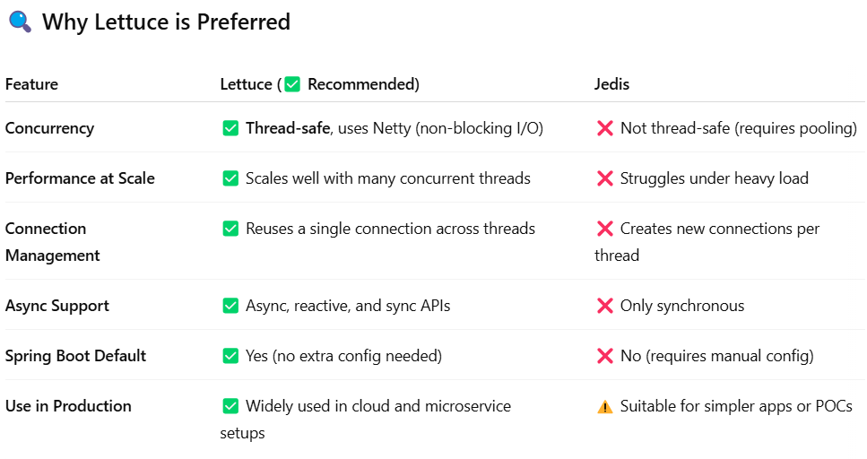

## Redis Commander Interface

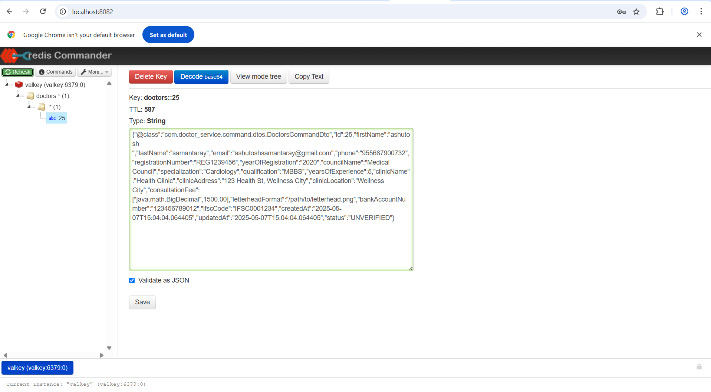

 


--------------------------------------------------------------------------------------------------------
<span style="color:green" > SPRING-SECURITY(SSO IMPLEMENTATION USING KEY-CLOAK)  </span>
--------------------------------------------------------------------------------------------------------
<span style="color:red" > 🔐 What is OpenID Connect (OIDC)?

OpenID Connect is an authentication protocol that extends OAuth 2.0.

OAuth 2.0: Mainly for authorization (i.e., giving access to resources).

OIDC: Adds authentication on top (i.e., verifying who the user is).

OIDC uses JWT (JSON Web Tokens) to securely send identity and access information.

<span style="color:red" > 📦 JWT (JSON Web Token)

JWT is a compact, secure format for transferring data.

It contains claims like username, email, roles, etc.

It's digitally signed, so it's tamper-proof.

It can be used to securely identify a user and check their permissions.

<span style="color:yellow" >🔄 Use Case 1: Application Authenticates a User

Your application (client) asks Keycloak to log in a user.

User logs in successfully.

Keycloak returns:

ID Token (who the user is – e.g., name, email, profile).

Access Token (what the user can do – e.g., roles, permissions).

These tokens are used by the app to:

Show personalized content.

Grant access to specific features or APIs.

<span style="color:yellow" >🔄 Use Case 2: Application Accesses Remote Services

The client application needs to access a remote REST API on behalf of the user.

It requests an access token from Keycloak.

Keycloak:

Authenticates the user.

Gets user consent.

Issues a signed access token.

The client then:

Sends this token to the remote REST service.

The remote service:

Extracts and verifies the token.

Checks roles/permissions inside the token.

Decides whether to allow or deny the request.

✅ In Summary

OIDC = OAuth 2.0 + Authentication.

Used to identify users and authorize access.

Keycloak issues JWT tokens for secure, stateless communication.

These tokens are used both by the app and by any backend APIs it calls.


# Keycloak Integration with Spring Boot Microservices

This repository demonstrates how to integrate Keycloak as an identity provider with Spring Boot microservices, supporting multiple authentication methods:

1. **Password Credentials** - For user-based authentication
2. **Client Credentials** - For service-to-service communication
3. **Social Identity Providers** - Including Google, GitHub, and Facebook logins

## Architecture Overview

The system uses a microservices architecture with:
- API Gateway (Spring Cloud Gateway)
- Multiple domain-specific microservices (Doctor, Patient, Appointment, etc.)
- Keycloak for centralized authentication and authorization

## Authentication Flows

### <span style="color:green">1. Keycloak Integration with Spring Boot Microservices using Grant type: Client Credentials</span>

Client Credentials flow is used for service-to-service authentication:

1. Services authenticate directly with Keycloak using client ID and secret
2. Keycloak issues a JWT token for the service
3. Services use this token for internal communication

### <span style="color:green">2. Keycloak Integration with Spring Boot Microservices using Grant type: Password Credentials</span>

User-based authentication using:
1. Users authenticate through Keycloak with username/password
2. Keycloak issues JWT tokens containing user roles and information
3. Microservices validate these tokens and authorize requests based on roles

### 3. Social Login Authentication

1. Users authenticate through external identity providers
2. Keycloak handles the OAuth2 redirection and token exchange
3. Roles are mapped based on Keycloak configuration

## Configuration Guide

## <span style="color:green">1. Keycloak Integration with Spring Boot Microservices using Grant type: Client Credentials</span>

### Dependencies

Add these dependencies to all your services (API Gateway + microservices):

```xml
<dependency>
    <groupId>org.springframework.boot</groupId>
    <artifactId>spring-boot-starter-oauth2-resource-server</artifactId>
</dependency>

<dependency>
    <groupId>org.springframework.boot</groupId>
    <artifactId>spring-boot-starter-oauth2-client</artifactId>
</dependency>

<dependency>
    <groupId>org.springframework.boot</groupId>
    <artifactId>spring-boot-starter-security</artifactId>
</dependency>
```

### Application Properties

In each service:

```properties
spring.security.oauth2.resourceserver.jwt.issuer-uri=http://localhost:8080/realms/healthcare-microservice-realm
```

Ensure this matches your Keycloak realm's issuer URL.

### API Gateway Security Configuration

```java
@Configuration
@EnableWebFluxSecurity
public class SecurityConfig {

    @Bean
    public SecurityWebFilterChain springSecurityFilterChain(ServerHttpSecurity http) {
        return http.csrf(ServerHttpSecurity.CsrfSpec::disable)
                .authorizeExchange(exchange -> exchange.pathMatchers("/eureka/**")
                        .permitAll()
                        .anyExchange().authenticated())
                .oauth2ResourceServer(oauth -> oauth.jwt(Customizer.withDefaults()))
                .build();
    }
}
```

### Microservice Security Configuration

```java
@Configuration
public class SecurityConfig {

    @Bean
    public SecurityFilterChain securityFilterChain(HttpSecurity http) throws Exception {
        http.csrf(AbstractHttpConfigurer::disable)
            .authorizeHttpRequests(auth -> auth
                .requestMatchers("/eureka/**").permitAll()
                .anyRequest().authenticated()
            )
            .oauth2ResourceServer(oauth -> oauth.jwt(Customizer.withDefaults()));
        return http.build();
    }
}
```

### Feign Client Token Forwarding

For service-to-service communication using Feign clients:

```java
@Configuration
public class FeignClientConfig {

    @Bean
    public RequestInterceptor requestInterceptor() {
        return requestTemplate -> {
            ServletRequestAttributes attributes = (ServletRequestAttributes) RequestContextHolder.getRequestAttributes();

            if (attributes != null) {
                HttpServletRequest request = attributes.getRequest();
                String authorizationHeader = request.getHeader("Authorization");

                if (authorizationHeader != null) {
                    requestTemplate.header("Authorization", authorizationHeader);
                    System.out.println("Forwarding Authorization Header: " + authorizationHeader);
                } else {
                    System.out.println("Authorization header is missing in request.");
                }
            } else {
                System.out.println("ServletRequestAttributes is null.");
            }
        };
    }
}
```

Use this configuration with your Feign clients:

```java
@FeignClient(name = "target-service", configuration = FeignClientConfig.class)
```

POSTMAN:

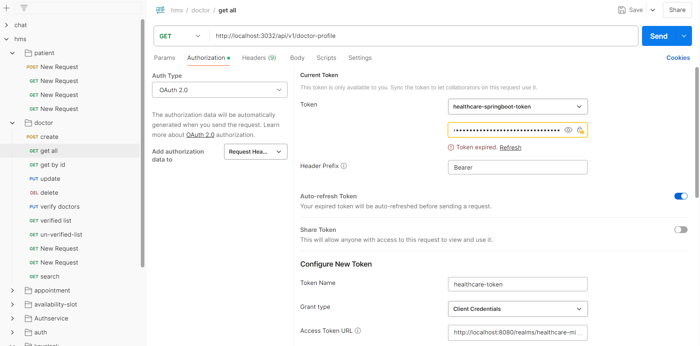

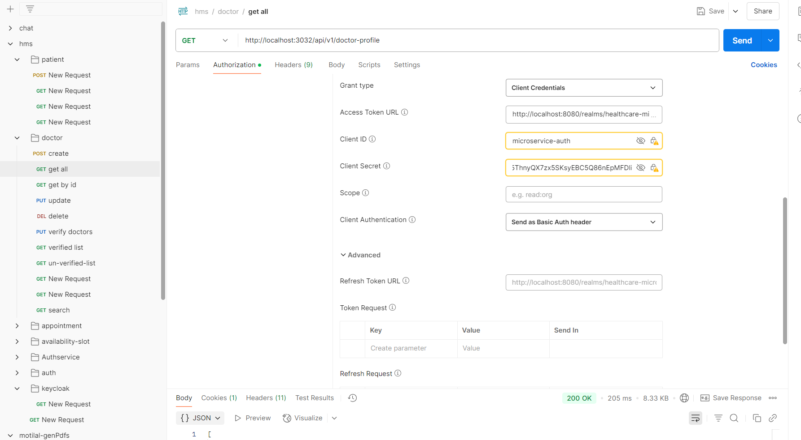

## <span style="color:green">2. Keycloak Integration with Spring Boot Microservices using Grant type: Password Credentials</span>

### 1. Gateway Security Configuration

The API Gateway is configured with the following security settings:

```java
@Configuration
@EnableWebFluxSecurity
public class SecurityConfig {

    @Bean
    public SecurityWebFilterChain springSecurityFilterChain(ServerHttpSecurity http) {
        return http
                .csrf(ServerHttpSecurity.CsrfSpec::disable)
                .authorizeExchange(exchange -> exchange.pathMatchers("/eureka/**")
                        .permitAll()
                        .pathMatchers("/api/v1/doctor-profile/**").hasAnyRole("Doctor", "Admin")
                        .pathMatchers("/api/v1/patient-profile/**").hasAnyRole("Patient", "Doctor", "Admin")
                        .anyExchange().authenticated()
                )
                .oauth2ResourceServer(oauth2 -> oauth2
                        .jwt(jwt -> jwt
                                .jwtAuthenticationConverter(grantedAuthoritiesConverter())
                        )
                )
                .build();
    }

    // This converter extracts Keycloak roles from the JWT token
    private Converter<Jwt, Mono<AbstractAuthenticationToken>> grantedAuthoritiesConverter() {
        ReactiveJwtAuthenticationConverter jwtAuthenticationConverter = new ReactiveJwtAuthenticationConverter();

        jwtAuthenticationConverter.setJwtGrantedAuthoritiesConverter(jwt -> {
            List<String> realmRoles = extractRealmRoles(jwt);

            // Create a Flux of GrantedAuthority objects directly
            return Flux.fromIterable(realmRoles)
                    .map(role -> (GrantedAuthority) new SimpleGrantedAuthority("ROLE_" + role));
        });

        return jwtAuthenticationConverter;
    }

    private List<String> extractRealmRoles(Jwt jwt) {
        Map<String, Object> realmAccess = jwt.getClaimAsMap("realm_access");
        if (realmAccess != null && realmAccess.containsKey("roles")) {
            return (List<String>) realmAccess.get("roles");
        }
        return Collections.emptyList();
    }
}
```

### 2. Gateway Routing Configuration

Routes are configured to direct traffic to appropriate microservices:

```java
@Configuration
public class GatewayConfig {
    @Bean
    public RouteLocator customRouteLocator(RouteLocatorBuilder builder) {
        return builder.routes()
                // Route for patient service
                .route("Patient-Service", r -> r
                        .path("/api/v1/patient-profile/**")
                        .filters(f -> f.rewritePath("/api/v1/patients/(?<path>.*)", "/${path}"))
                        .uri("lb://Patient-Service"))

                // Route for doctor service
                .route("Doctor-Service", r -> r
                        .path("/api/v1/doctor-profile/**")
                        .filters(f -> f.rewritePath("/api/v1/doctors/(?<path>.*)", "/${path}"))
                        .uri("lb://Doctor-Service"))

                // Route for Appointment service
                .route("Appointment-Service", r -> r
                        .path("/api/v1/appointments/**")
                        .uri("lb://Appointment-Service"))

                // Route for AvailabilitySlot Service
                .route("AvailabilitySlot-Service", r -> r
                        .path("/api/v1/availability-slots/**")
                        .uri("lb://AvailabilitySlot-Service"))

                .route("AuthService", r -> r
                        .path("/api/v1/auth/**")
                        .uri("lb://AuthService"))

                .build();
    }
}
```

### 3. JWT Configuration

Add these properties to your `application.properties` or `application.yml` in all services, including the gateway:

```properties
spring.security.oauth2.resourceserver.jwt.issuer-uri=http://localhost:8080/realms/healthcare-realm
spring.security.oauth2.resourceserver.jwt.jwk-set-uri=http://localhost:8080/realms/healthcare-realm/protocol/openid-connect/certs
```

### 4. Microservice Security Configuration

Each microservice implements the following security configuration:

```java
@Configuration
@EnableMethodSecurity
@EnableWebSecurity
public class ResourceServerConfig {

    @Bean
    public SecurityFilterChain securityFilterChain(HttpSecurity http) throws Exception {
        http
                .csrf(AbstractHttpConfigurer::disable)
                .authorizeHttpRequests(authorize -> authorize
                        .anyRequest().authenticated()
                )
                .oauth2ResourceServer(oauth2 -> oauth2
                        .jwt(jwt -> jwt
                                .jwtAuthenticationConverter(jwtAuthenticationConverter())
                        )
                );

        return http.build();
    }

    private JwtAuthenticationConverter jwtAuthenticationConverter() {
        JwtAuthenticationConverter converter = new JwtAuthenticationConverter();

        converter.setJwtGrantedAuthoritiesConverter(jwt -> {
            Map<String, Object> realmAccess = jwt.getClaimAsMap("realm_access");
            if (realmAccess == null || !realmAccess.containsKey("roles")) {
                return Collections.emptyList();
            }

            List<String> roles = (List<String>) realmAccess.get("roles");
            return roles.stream()
                    .map(role -> new SimpleGrantedAuthority("ROLE_" + role)) // Keep original case from Keycloak
                    .collect(Collectors.toList());
        });

        return converter;
    }
}
```

## Keycloak Configuration

### Setting Up Social Identity Providers

#### 1. Google Identity Provider

1. In Keycloak Admin Console, go to your realm → Identity Providers
2. Add Google provider with:
 - Client ID and Secret from Google Developer Console
 - Appropriate scopes (openid, email, profile)
 - Configure mappers for roles and attributes

#### 2. GitHub Identity Provider

1. In Keycloak Admin Console, go to your realm → Identity Providers
2. Add GitHub provider with:
 - Client ID and Secret from GitHub Developer settings
 - Configure appropriate scopes
 - Set up mappers for roles and attributes

#### 3. Facebook Identity Provider

1. In Keycloak Admin Console, go to your realm → Identity Providers
2. Add Facebook provider with:
 - Client ID and Secret from Facebook Developer Portal
 - Configure appropriate scopes
 - Set up mappers for roles and attributes

### Role Management

1. Create realm roles in Keycloak (Admin, Doctor, Patient, etc.)
2. Set default roles for new users
3. Configure role mappings for each identity provider
4. Use either:
 - Domain-based mapping (e.g., hospital emails get Doctor role)
 - Attribute-based mapping
 - Manual assignment for sensitive roles

## Usage

To use this authentication system:

1. Users navigate to the login page
2. They can choose to login with:
 - Username/password
 - Social identity providers (Google, GitHub, Facebook)
3. The system authenticates users through Keycloak
4. Appropriate roles are assigned based on configuration
5. JWT tokens containing roles are issued
6. Microservices validate tokens and authorize access

## Security Considerations

- Configure proper CORS settings
- Use HTTPS in production
- Regularly review role assignments
- Implement proper token validation
- Consider adding MFA for sensitive roles

## Dependencies

- Spring Boot
- Spring Security
- Spring Cloud Gateway
- Keycloak
- Spring OAuth2 Resource Server
